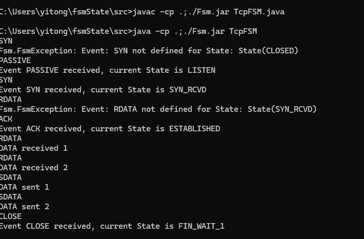

- Ensure that `TcpFSM.java` and `Fsm.jar` are located in the same directory.


1. **Open the directory** where both `TcpFSM.java` and `Fsm.jar` are located.

2. **Compile the code** by running the following command in your terminal:
   ```bash
   javac -cp .;./Fsm.jar TcpFSM.java
   ```

3. **Run the application** with the following command:
   ```bash
   java -cp .;./Fsm.jar TcpFSM
   ```

## example:


**

